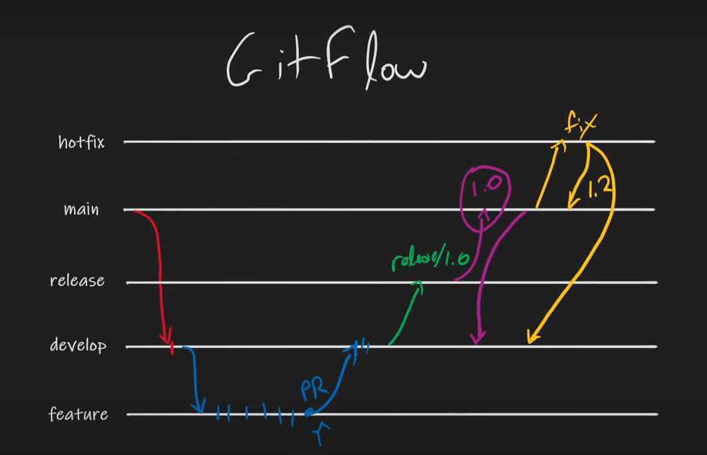

[(40) Branching Strategies Explained - YouTube](https://www.youtube.com/watch?v=U_IFGpJDbeU)

### Trunk Based Development:

- Single Branch (Mainline)
- High Team Maturity
- Feature Toggles
- Automated Test and Deploy
- Continous Deployment

 #### [Demo Repo](https://github.com/INTEC-1098851/trunk-based-branching)

### Feature Branching

- One Branch per Feature
- Short Delivery Cycles
- Continous Delivery
- Pull Requests
- Low Level of Madness (Pull Request, Merge)

 #### [Demo Repo](https://github.com/INTEC-1098851/feature-branching)

### Fork Strategy

- Forking Repositories
- Mostly Open Sources
- Fewer Restrictions
- Create Pull Request to original upstream
- Anybody can read, but not write in mainline
- Review Pull Request

### Release Branching

- One Branch Per Release
- Additional Branch for Hot Fixes and then merge to release and then to mainline
- Low Frequency Deployments
- Merge Conflicts and Deviations
- No continous anything
- Use this only to support for previous releases
- Medium madness level

 #### [Demo Repo](https://github.com/INTEC-1098851/release-branching)

### Git Flow

- Dev branch with additional branch for feature 1 and release 1 and so on..

 #### [Demo Repo](https://github.com/INTEC-1098851/git-flow-branching)

### GitHub Flow

- Main line and feature branches, PR request to test automation and integration test.

 #### [Demo Repo](https://github.com/INTEC-1098851/github-flow)

### Environment Branching

- Environment branchs on top of all others (R1→dev→staging→integration)

## Merge Strategies

- Fast Forward Merge (Straight line, no changes in master)
- Recursive Merge (New commits on master)

A merge happens when combining two branches. Git will take two (or more) commit pointers and attempt to find a common base commit between them. Git has several different methods to find a base commit, these methods are called "merge strategies". Once Git finds a common base commit it will create a new "merge commit" that combines the changes of the specified merge commits. Technically, a merge commit is a regular commit which just happens to have two parent commits.

# Recursive

`git merge -s recursive branch1 branch2`

This operates on two heads. Recursive is the default merge strategy when pulling or merging one branch. Additionally this can detect and handle merges involving renames, but currently cannot make use of detected copies. This is the default merge strategy when pulling or merging one branch.

# Resolve

`git merge -s resolve branch1 branch2`

This can only resolve two heads using a 3-way merge algorithm. It tries to carefully detect cris-cross merge ambiguities and is considered generally safe and fast.

# Octopus

`git merge -s octopus branch1 branch2 branch3 branchN`

The default merge strategy for more than two heads. When more than one branch is passed octopus is automatically engaged. If a merge has conflicts that need manual resolution octopus will refuse the merge attempt. It is primarily used for bundling similar feature branch heads together.

# Ours

`git merge -s ours branch1 branch2 branchN`

The Ours strategy operates on multiple N number of branches. The output merge result is always that of the current branch `HEAD`. The "ours" term implies the preference effectively ignoring all changes from all other branches. It is intended to be used to combine history of similar feature branches.

# Subtree

`git merge -s subtree branchA branchB`

This is an extension of the recursive strategy. When merging A and B, if B is a child subtree of A, B is first updated to reflect the tree structure of A, This update is also done to the common ancestor tree that is shared between A and B.